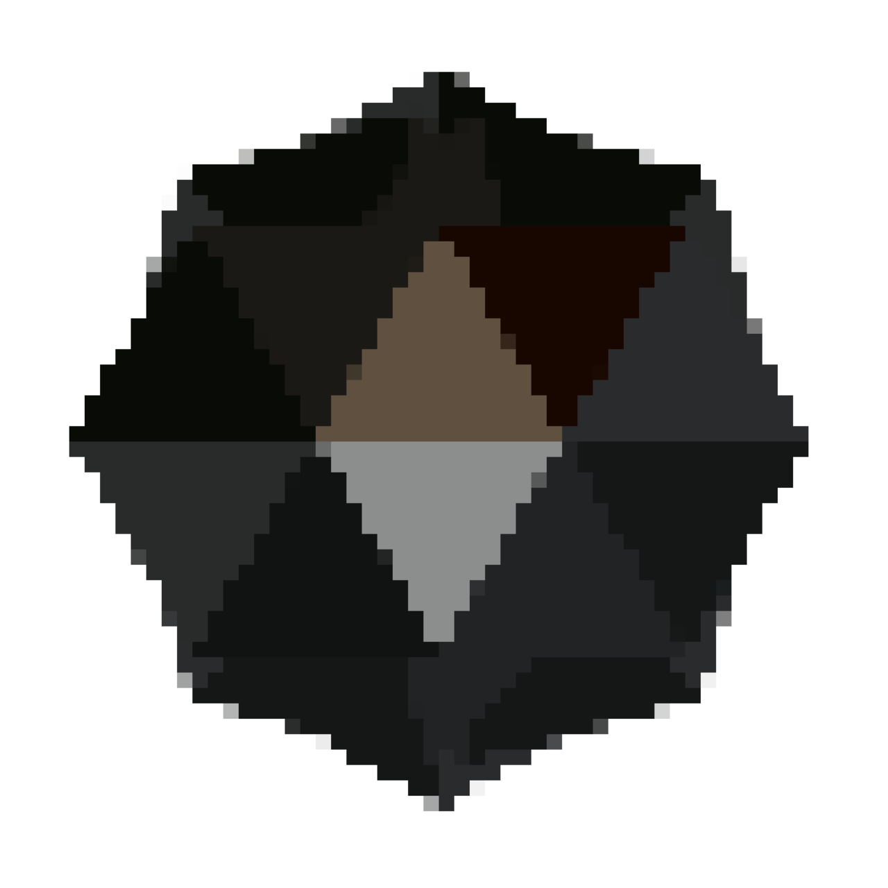

# The Cinder Programming Language



So, for a long time of overthinking I finally realized things that I hate in C and... I wanna try fix them.

```rust
use "std/io.cnd";

fn main() -> i32 {
    let greetings = [
        "Hello world",
        "Привет, мир!",
        "¡Hola Mundo!",
        "Привіт, світе!"
        ];

    for value in greetings {
        println(value);
    }
    return 0;
}
```

## Features
- Minimalism
- Explicitness
- C compatibility
- Bare metal
- Fast compilation
- LLVM backend

## License
See the file [LICENSE](LICENSE).

## Contributing
Just send pull-request! Any helpful PR are welcome :3